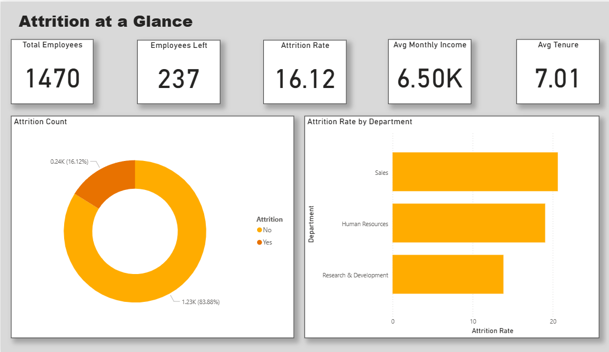
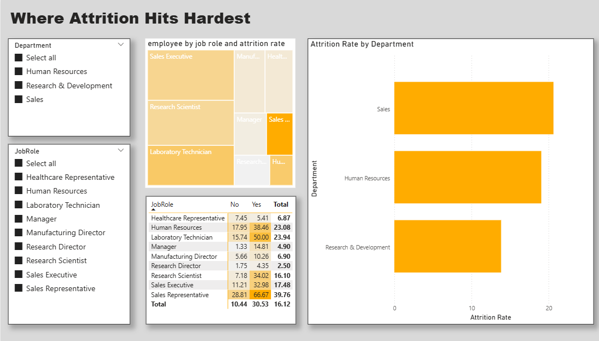
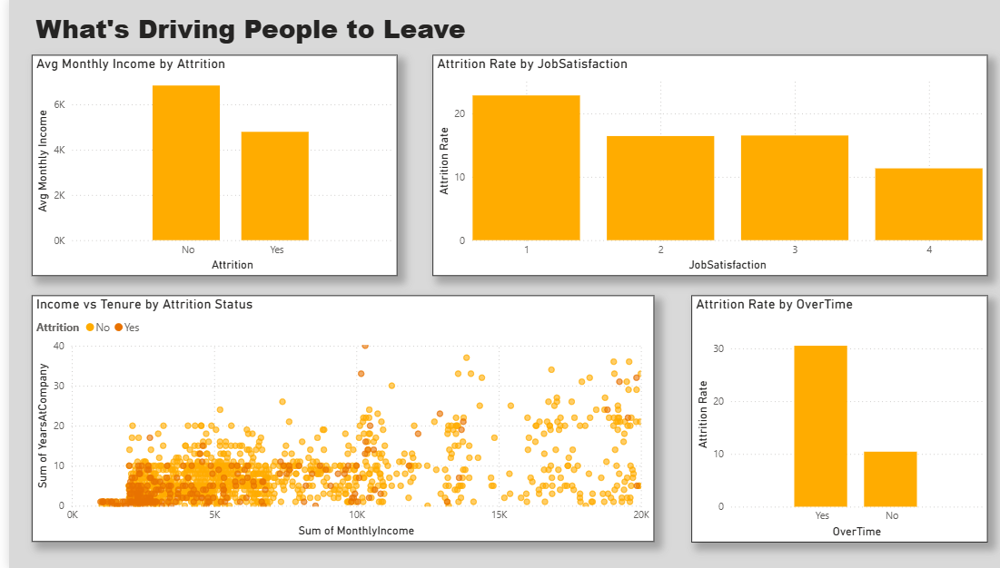
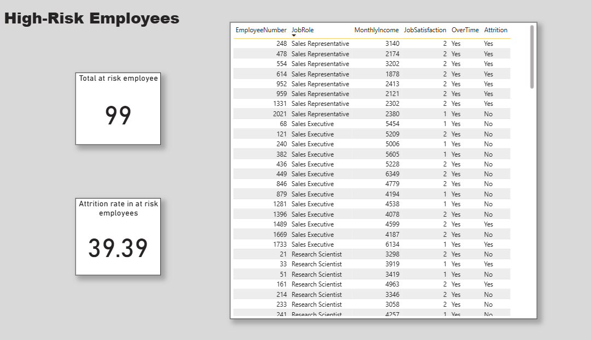

# HR Employee Attrition Analysis

End-to-end analysis of employee attrition using IBM's HR Analytics dataset (1,470 employees, 35 attributes), built across Excel, SQL, and Power BI.

## Tools Used
Excel (Power Query, Pivot Tables) | SQL (SQLite) | Power BI (DAX, drill-down, conditional formatting)

## Key Findings
- **Sales Representatives have the highest attrition rate (38%)** — nearly 2.5x the company average of 16.1%
- **Overtime triples attrition risk** — 30.5% attrition for employees working overtime vs 10.4% for those who don't
- **Compound risk: Sales Reps working overtime leave at 66.7%** — the single highest-risk segment in the company
- **Compensation gap:** employees who left earned ~30% less on average (₹4,787 vs ₹6,833)
- **High-risk segment identified:** 99 employees (overtime + low job satisfaction + below-average income) show a 39.4% attrition rate — 2.4x the baseline — a clear target for HR retention efforts

## Process
1. **Excel:** Cleaned data via Power Query, built pivot tables to establish baseline attrition rates by department, job role, and overtime status
2. **SQL:** Reproduced and extended Excel findings using GROUP BY aggregations, CTEs, window functions (RANK, PARTITION BY), and subqueries to build a compound risk-flagging query
3. **Power BI:** Built a 4-page interactive dashboard — Overview, Department Drill-Down, Drivers of Attrition, and an At-Risk Employee segment view with conditional formatting

## Dashboard Pages
- **Overview:** KPI cards, attrition split, department snapshot

- **Department Drill-Down:** Interactive Department → Job Role drill-down, risk matrix

- **Drivers of Attrition:** Income, tenure, satisfaction, and overtime impact on attrition

- **At-Risk Employees:** Filtered list of 99 high-risk employees with supporting KPIs

## Files
- `attrition_queries.sql` — all SQL queries used
- `hr_attrition_dashboard.pbix` — Power BI dashboard file
  
